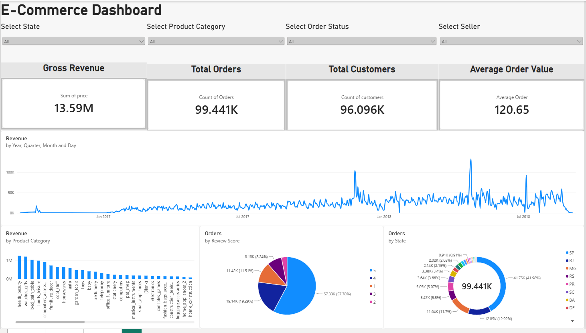
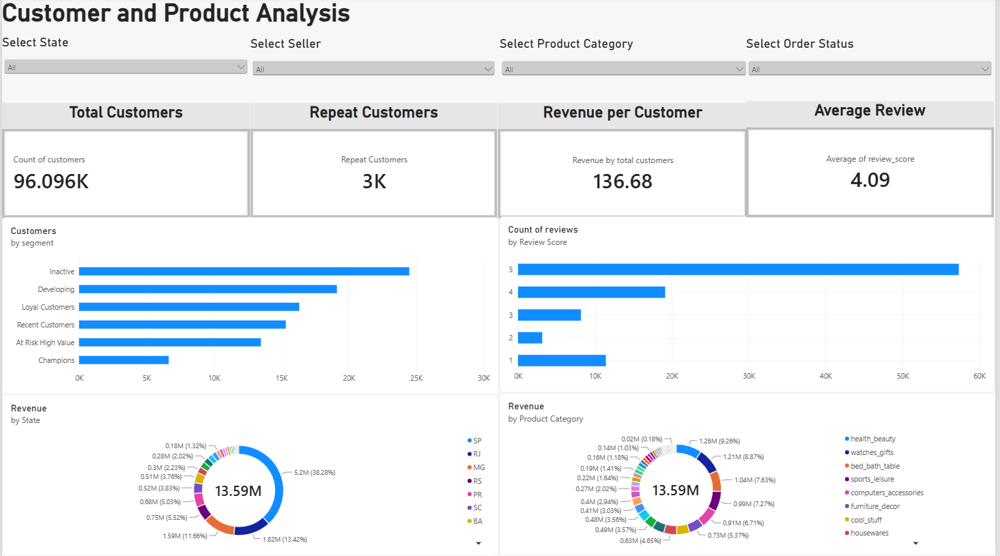
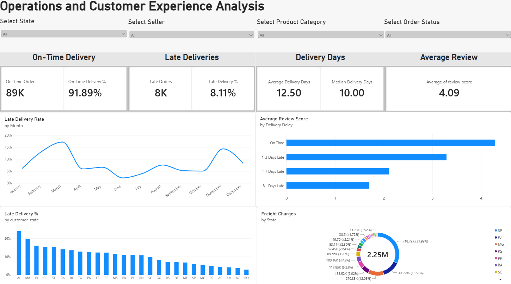

# 📈 Power BI Dashboards: Brazilian E-Commerce Analytics

This directory contains the interactive Power BI report (`E-Commerce Analytics.pbix`) and exported dashboard snapshots. When browsing this folder on GitHub, the dashboards are displayed below with visual breakdowns and KPI definitions.

---

## 📊 Dashboard Overview

The dashboard comprises **three comprehensive report pages** designed for executive leadership, commercial category managers, and logistics operations teams:
1. **Page 1: E-Commerce Dashboard** — Executive overview of revenue, order volume, category contribution, and geographic distribution.
2. **Page 2: Customer and Product Analysis** — Deep dive into customer retention, repeat purchasing behavior, and RFM behavioral segmentation.
3. **Page 3: Operations and Customer Experience Analysis** — Fulfillment reliability, delivery lead times, regional SLA performance, and review score impact.

---

## 🖥️ Page 1: E-Commerce Dashboard (Executive Overview)

High-level summary of financial performance, seasonal trends, and core marketplace volume metrics.

### Slicers & Global Filters
- **Select State**: Filter performance across all 27 Brazilian federative units.
- **Select Product Category**: Drill into specific merchandise lines.
- **Select Order Status**: Filter by `delivered`, `shipped`, `canceled`, `invoiced`, etc.
- **Select Seller**: Filter by individual seller ID to analyze merchant contributions.

### Core KPI Metrics
| Metric | Value | Description |
|---|---|---|
| **Gross Revenue** | **R$ 13.59M** | Total merchandise sales value across all fulfilled orders |
| **Total Orders** | **99.441K** | Total number of marketplace orders placed |
| **Total Customers** | **96.096K** | Total count of distinct purchasing customers |
| **Average Order Value** | **R$ 120.65** | Average product sales value generated per order |

### Visual Breakdown
- **Revenue by Year, Quarter, Month, and Day**: Daily and monthly sales trajectory highlighting steady growth across 2017–2018 with a prominent spike in November 2017 (Black Friday).
- **Revenue by Product Category**: Horizontal ranking showing the revenue dominance of categories like `health_beauty`, `watches_gifts`, `bed_bath_table`, and `sports_leisure`.
- **Orders by Review Score**: Donut/pie breakdown indicating customer sentiment (57.78% 5-star reviews, 19.29% 4-star reviews, and 11.51% 1-star reviews).
- **Orders by State**: Geographic order distribution demonstrating São Paulo's leading market share (41.98%), followed by Rio de Janeiro (12.92%) and Minas Gerais (11.70%).

---

## 👥 Page 2: Customer and Product Analysis

Focuses on customer lifetime value, repurchase dynamics, and actionable behavioral clustering through RFM segmentation.

### Slicers & Global Filters
- **Select State**, **Select Seller**, **Select Product Category**, **Select Order Status**.

### Core KPI Metrics
| Metric | Value | Description |
|---|---|---|
| **Total Customers** | **96.096K** | Total unique buyers across the platform |
| **Repeat Customers** | **3K (~3.1%)** | Customers who placed more than one order |
| **Revenue per Customer** | **R$ 136.68** | Average spend per unique customer |
| **Average Review** | **4.09 / 5.0** | Marketplace-wide average customer rating |

### Visual Breakdown
- **Customers by Segment**: Distribution of customers across 6 behavioral tiers:
  - **Inactive (~24.5K)**: Dormant single-purchase buyers who haven't ordered recently.
  - **Developing (~19.0K)**: Average spenders with moderate recency.
  - **Loyal Customers (~16.3K)**: Repeat buyers with consistent order frequency.
  - **Recent Customers (~15.3K)**: Newly acquired customers requiring initial retention engagement.
  - **At Risk High Value (~13.5K)**: High-spend customers whose purchasing recency has elapsed; primary target for win-back campaigns.
  - **Champions (~6.6K)**: Top-tier customers with high recency, frequency, and spend.
- **Count of Reviews by Review Score**: Distribution of ratings highlighting the polarization between high satisfaction (5★) and critical complaints (1★).
- **Revenue by State**: Donut visualization of revenue contribution by state (SP: R$ 5.20M / 38.28%, RJ: R$ 1.82M / 13.42%, MG: R$ 1.59M / 11.66%).
- **Revenue by Product Category**: Donut visualization showing GMV concentration across leading product sectors.

---

## 🚚 Page 3: Operations and Customer Experience Analysis

Evaluates delivery timelines, fulfillment reliability, regional bottlenecks, and shipping costs.

### Slicers & Global Filters
- **Select State**, **Select Seller**, **Select Product Category**, **Select Order Status**.

### Core KPI Metrics
| Metric | Value | Description |
|---|---|---|
| **On-Time Delivery** | **89K (91.89%)** | Orders delivered on or before the estimated delivery date |
| **Late Deliveries** | **8K (8.11%)** | Orders delivered after the promised delivery date |
| **Average Delivery Days** | **12.50 Days** | Mean fulfillment lead time from purchase to door |
| **Median Delivery Days** | **10.00 Days** | Typical fulfillment lead time (less sensitive to outliers) |
| **Average Review** | **4.09 / 5.0** | Platform satisfaction benchmark |

### Visual Breakdown
- **Late Delivery Rate by Month**: Time-series tracking late delivery fluctuations, revealing fulfillment degradation during high-demand periods (peaks in March ~17% and November ~14%).
- **Average Review Score by Delivery Delay**: Bar chart revealing the steep degradation in customer satisfaction as delays increase:
  - **On Time**: ~4.29★ average rating
  - **1–3 Days Late**: ~3.30★ average rating
  - **4–7 Days Late**: ~2.10★ average rating
  - **8+ Days Late**: ~1.70★ average rating
- **Late Delivery % by Customer State**: Geographic disparity ranking all 27 states; Northern and Northeastern states (`AL`, `MA`, `PI`, `CE`, `SE`) experience delay rates of 15% to 24%, compared to southern states under 8%.
- **Freight Charges by State**: Total freight expenditure (R$ 2.25M), with São Paulo accounting for R$ 718.72K (31.92%), RJ accounting for R$ 305.59K (13.57%), and MG accounting for R$ 270.85K (12.03%).

---

## 🛠️ How to Open and Explore the Report

1. **Install Power BI Desktop**:
   Download the latest version of [Microsoft Power BI Desktop](https://powerbi.microsoft.com/desktop/) (free).
2. **Open the File**:
   Double-click `E-Commerce Analytics.pbix` located in this directory.
3. **Interactive Slicing & Cross-Filtering**:
   - Click on any category bar or state slice to cross-filter other charts across the page.
   - Use the top dropdown slicers (State, Category, Status, Seller) to analyze specific sub-segments.
   - Hold `Ctrl` while clicking to multi-select filters.
