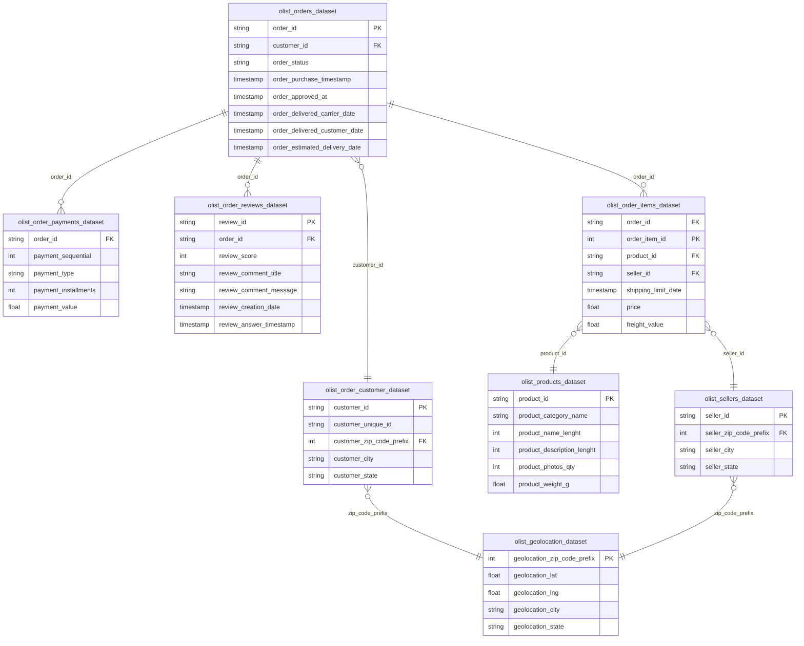

# 📊 Brazilian E-Commerce Data Analytics Platform

[](https://www.python.org/)
[](https://neon.tech/)
[](https://powerbi.microsoft.com/)
[](https://www.kaggle.com/datasets/olistbr/brazilian-ecommerce)

An end-to-end data analytics project exploring customer behavior, sales dynamics, logistics performance, and customer satisfaction across the Brazilian marketplace [Olist](https://www.kaggle.com/datasets/olistbr/brazilian-ecommerce) between 2016 and 2018.

---

## 1. Problem Statement

Operating a large-scale e-commerce marketplace involves balancing diverse stakeholders: customers, independent merchants, and third-party logistics carriers across vast geographic regions. 

This project addresses five critical business questions:
1. **Sales Performance & Growth**: What are the historical revenue drivers, seasonal trends, and high-value product categories?
2. **Customer Retention**: What proportion of the customer base makes repeat purchases, and how can customers be segmented to maximize customer lifetime value (LTV)?
3. **Fulfillment & Delivery Reliability**: How reliably are delivery promises kept across different Brazilian states, and what are the operational bottlenecks?
4. **Impact on Customer Experience**: Does fulfillment speed and delivery delay directly influence customer review ratings? Is this relationship statistically significant?
5. **Actionable Growth Levers**: What strategic interventions in logistics, category management, and customer marketing will yield the highest return?

---

## 2. Dataset Architecture

The analysis is based on the real-world [Brazilian E-Commerce Public Dataset by Olist](https://www.kaggle.com/datasets/olistbr/brazilian-ecommerce) hosted on Kaggle. The dataset contains **~100,000 orders** fulfilled between September 2016 and October 2018 across 27 federative units in Brazil.

### Relational Schema



#### Dataset Relationship Mapping

| Left Dataset | Key Connection | Right Dataset | Description |
|---|:---:|---|---|
| `olist_orders_dataset` | `customer_id` | `olist_order_customer_dataset` | Links orders to purchasing customer details |
| `olist_orders_dataset` | `order_id` | `olist_order_items_dataset` | Connects orders to individual line items |
| `olist_orders_dataset` | `order_id` | `olist_order_payments_dataset` | Relates orders to payment transactions and installments |
| `olist_orders_dataset` | `order_id` | `olist_order_reviews_dataset` | Associates orders with customer feedback and ratings |
| `olist_order_items_dataset` | `product_id` | `olist_products_dataset` | Maps each line item to product specifications |
| `olist_order_items_dataset` | `seller_id` | `olist_sellers_dataset` | Identifies the fulfilling merchant for each item |
| `olist_order_customer_dataset` | `zip_code_prefix` | `olist_geolocation_dataset` | Resolves customer zip codes to geographic coordinates |
| `olist_sellers_dataset` | `zip_code_prefix` | `olist_geolocation_dataset` | Resolves seller zip codes to geographic coordinates |

---

## 3. Analysis Overview

The analysis was executed across six focused Jupyter notebooks in Python and a cloud PostgreSQL database, taking the data from raw ingestion to statistical testing:

```
01 Data Cleaning ──> 02 SQL Ingestion ──> 03 Sales Analysis ──> 04 Customer RFM ──> 05 Customer Experience ──> 06 Statistical EDA
```

- **Data Cleaning & Preprocessing (`01`)**: Automated data ingestion, resolution of missing delivery timestamps, elimination of corrupted records, and datetime normalization.
- **Database Storing & Ingestion (`02`)**: Uploaded cleaned tables into a cloud PostgreSQL (NeonDB) warehouse using SQLAlchemy. Validated schema integrity, reconciled financial metrics (**R$ 13.59M** merchandise sales + **R$ 2.25M** freight = **R$ 15.84M** total GMV), and analyzed baseline monthly order volume.
- **Sales & Product Dynamics (`03`)**: Category-level Pareto analysis (the top 7 categories drive >50% of revenue) and geographic analysis (São Paulo accounts for ~38.3% of revenue and ~42% of order volume). Marketplace cancellation rate verified at **0.63%**.
- **Customer Segmentation (`04`)**: Discovered that **96.9%** of buyers are one-time purchasers. Designed a quintile-based **RFM model** (Recency, Frequency, Monetary) categorizing customers into 6 tiers: *Champions*, *Loyal*, *Recent*, *At Risk High Value*, *Inactive*, and *Developing*.
- **Logistics & Customer Experience (`05`)**: Evaluated order fulfillment cycles. Established baseline SLA metrics: **91.89% on-time delivery** vs **8.11% late delivery**. Mapped geographical fulfillment disparities across states and demonstrated that late orders experience a severe decline in review ratings.
- **Statistical EDA & Hypothesis Testing (`06`)**: Distribution analysis showing strong right-skew in order value (median R$ 86.90 vs mean R$ 137.75). Proved via **Mann-Whitney U Test** ($p < 0.001$) and **Spearman Rank Correlation** ($\rho = -0.176, p < 0.001$) that delivery delays have a statistically significant negative impact on review scores.

> ℹ️ *For detailed methodology, queries, and technical walkthroughs for each notebook, see the [Notebooks Directory Documentation](notebooks/README.md).*  
> 📈 *For the comprehensive strategic business report, see [Executive Insights Report](reports/INSIGHTS.md).*

---

## 4. Power BI Interactive Dashboard

An interactive 3-page Power BI dashboard (`power bi/E-Commerce Analytics.pbix`) was built to translate analytical findings into visual, self-serve business intelligence tools for executive and operational teams.

### Page 1: Executive E-Commerce Overview
Provides high-level performance metrics, sales trends over time, category performance, and geographic order concentration.


- **Gross Revenue**: R$ 13.59M across 99.44K orders with an Average Order Value (AOV) of R$ 120.65.
- **Revenue Trends**: Strong sales expansion through 2017–2018 with a pronounced peak in November 2017 (Black Friday).
- **Top Categories**: `health_beauty`, `watches_gifts`, `bed_bath_table`, and `sports_leisure` lead overall sales volume.
- **Geographic Concentration**: Southeast region dominates total orders (São Paulo alone represents ~42%).

---

### Page 2: Customer and Product Analysis
Explores customer retention, repeat purchasing patterns, and RFM-based behavioral customer segmentation.


- **Retention Rate**: Only ~3.1% (~3,000 customers) are repeat purchasers, with an average revenue per customer of R$ 136.68.
- **Customer Segmentation**:
  - **Champions & Loyal**: Highly engaged core customers delivering recurring value.
  - **Recent Customers**: High-recency new acquisitions requiring immediate onboarding journeys.
  - **At Risk High Value**: High lifetime value customers drifting into dormancy requiring win-back campaigns.
  - **Inactive**: Largest single segment (~24.5K customers) consisting of one-time buyers.

---

### Page 3: Operations and Customer Experience Analysis
Examines delivery reliability, fulfillment delays, shipping cost distribution, and their direct impact on customer ratings.


- **Fulfillment SLA**: 91.89% on-time delivery rate (89K orders) vs 8.11% late delivery rate (8K orders).
- **Delivery Timeline**: Mean delivery duration of 12.5 days (median 10.0 days).
- **Impact of Delay on Ratings**:
  - **On-Time**: ~4.3 / 5.0 average review rating.
  - **1–3 Days Late**: ~3.3 rating.
  - **4–7 Days Late**: ~2.1 rating.
  - **8+ Days Late**: Plummets to ~1.7 rating.
- **Regional Bottlenecks**: Northern/Northeastern states (`AL`, `MA`, `PI`, `CE`, `SE`) suffer the highest late delivery rates (>15–24%).

> 🔍 *For detailed visual descriptions and slicer guides, see the [Power BI Directory README](power%20bi/README.md).*

---

## 5. Tools & Technologies Used

- **Data Processing & Analysis**: Python (Pandas, NumPy)
- **Statistical Modeling**: SciPy (Mann-Whitney U, Spearman Rank Correlation)
- **Data Visualization**: Matplotlib, Seaborn, Plotly Express
- **Database & SQL**: PostgreSQL (NeonDB Cloud Serverless), SQLAlchemy, psycopg2
- **Business Intelligence**: Power BI Desktop, DAX, Star Schema Data Modeling
- **Data Acquisition**: KaggleHub API

---

## 6. How to Get Started

### Prerequisites
- Python 3.9+ installed
- Power BI Desktop (to view the `.pbix` file)
- PostgreSQL database (optional, if recreating the relational database)

### Installation & Setup

1. **Clone the repository**:
   ```bash
   git clone https://github.com/Ayush-D2004/E-Commerce-Analytics.git
   cd E-Commerce-Analytics
   ```

2. **Set up virtual environment & install dependencies**:
   ```bash
   python -m venv venv
   source venv/bin/activate  # On Windows: venv\Scripts\activate
   pip install pandas numpy scipy matplotlib seaborn plotly sqlalchemy psycopg2-binary kagglehub
   ```

3. **Explore the Notebooks**:
   Launch Jupyter Notebook or JupyterLab:
   ```bash
   jupyter notebook notebooks/
   ```
   Execute the notebooks sequentially from `01` to `06`.

4. **Open the Power BI Dashboard**:
   - Navigate to the `power bi/` directory.
   - Open `E-Commerce Analytics.pbix` in **Power BI Desktop**.

